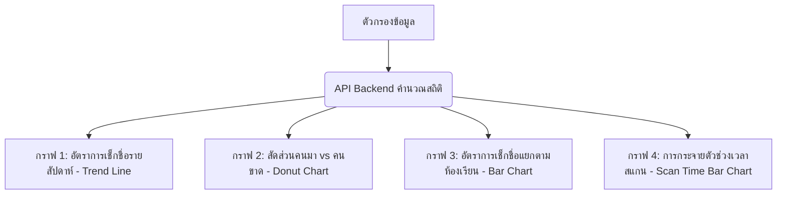

# แผนการพัฒนาหน้า: ภาพรวมและสถิติระบบเช็กชื่อ (System Attendance Overview & Advanced Dashboard)

เอกสารนี้แสดงรายละเอียดการวางแผนพัฒนาและปรับปรุงหน้า **"ภาพรวมระบบเช็กชื่อ" (Dashboard)** สำหรับผู้ดูแลระบบ (Admin) เพื่อเป็นศูนย์กลางการวิเคราะห์สถิติ คัดกรองรายชื่อผู้เข้าเรียน/ขาดเรียน และการทำกราฟสถิติแบบเต็มระบบที่สวยงามและใช้งานง่ายบนอุปกรณ์ทุกขนาด (Responsive Web Design)

---

## 🛠️ สิ่งที่ต้องพิจารณาและตัดสินใจร่วมกัน (User Review Required)

> [!IMPORTANT]
> **1. การเลือกใช้เทคโนโลยีกราฟ (Native SVG vs Third-party Library)**
> - **แนวทางที่เสนอ**: เราจะพัฒนาตัวเลือกกราฟโดยใช้ **Native Responsive SVG Components**
> - **เหตุผล**: โหลดได้รวดเร็วมาก ปรับแต่งสีและสไตล์ตามธีมระบบได้โดยตรงด้วย CSS และหมดปัญหาเรื่องความเข้ากันได้กับ React 19 (ต่างจาก Recharts หรือ Chart.js เวอร์ชันเก่าที่มีปัญหาเรนเดอร์ใน React 19)
> - **ผลลัพธ์**: ได้กราฟที่เคลื่อนไหวได้ (Animations), มี Tooltip แสดงข้อมูลเวลาเอาเมาส์ชี้, และมีความลื่นไหลเป็นพิเศษ

> [!NOTE]
> **2. แหล่งอ้างอิงข้อมูลคนขาดเรียน (Absent List)**
> - ระบบจะนำรายชื่อทั้งหมดจากตาราง **"จัดการรายชื่อนักเรียน" (Roster / ตาราง students)** มาทำการลบด้วยรายชื่อของนักเรียนที่สแกนเช็กชื่อเข้าเรียนสำเร็จในคาบกิจกรรมนั้นๆ (ตาราง `attendances`) ทำให้สามารถแสดงรายชื่อคนขาดเรียนได้อย่างแม่นยำ 100% พร้อมแสดงสถิติและปุ่มช่วยเช็กชื่อแมนนวลกรณีนักเรียนลืมโทรศัพท์

---

## 📊 ฟังก์ชันและองค์ประกอบหลักในหน้าแดชบอร์ดใหม่

ระบบจะประกอบด้วย 5 ส่วนสำคัญในการแสดงผลและการโต้ตอบ ดังนี้:

### 1. แผงควบคุมและตัวกรองขั้นสูง (Advanced Filters Panel)
ช่วยให้คุณครูสามารถวิเคราะห์ข้อมูลแบบเจาะจงเฉพาะกลุ่มได้ทันที:
- **เลือกสัปดาห์/คาบกิจกรรม (Week/Session Selector)**: ดึงรายการคาบเรียนทั้งหมดจากฐานข้อมูลมาให้เลือกดูย้อนหลัง
- **คัดกรองระดับชั้นปี (Class Year Filter)**: เลือกดูชั้นปีที่ต้องการ (ปี 1, ปี 2, ปี 3, ปี 4 หรือดูทั้งหมด)
- **คัดกรองสาขาวิชา (Major Code Filter)**: เลือกดูรายสาขา (ชทค, คพ, ทส หรือตามที่แอดมินกำหนดไว้)
- **คัดกรองห้องเรียน (Room Filter)**: เลือกดูเจาะลึกเฉพาะห้องเรียน (ห้อง 1, ห้อง 2, ห้อง 3, ห้อง 4, ห้อง 5)
- **ปุ่มรีเซ็ตตัวกรอง (Reset Filter)**: เพื่อล้างตัวกรองทั้งหมดกลับมาแสดงข้อมูลภาพรวมระบบในคลิกเดียว

### 2. การ์ดดัชนีชี้วัดประสิทธิภาพ (KPI Metric Cards & Circular Gauge)
แสดงตัวเลขสถิติสำคัญที่คำนวณแบบ Realtime ตามตัวกรองที่เลือก:
- **อัตราการเข้าเรียน (%) (Circular Radial Progress)**:
  - วงกลมสถิติไล่ระดับสี (Color Gradient) จากแดง/เหลืองไปจนถึงเขียวตามสัดส่วนการเข้าเรียน
  - มีตัวเลขเปอร์เซ็นต์ขนาดใหญ่ที่กึ่งกลางวงกลม
- **การ์ดสรุปสถิตินักศึกษา**:
  - **มาเรียน (Present)**: แสดงจำนวนและสัดส่วนนักเรียนที่เข้าเรียนเรียบร้อยแล้ว (สีเขียวพรีเมียม)
  - **ขาดเรียน (Absent)**: แสดงจำนวนนักเรียนที่ยังไม่ได้เช็กชื่อในสัปดาห์นี้ (สีแดงพรีเมียม)
  - **ยอดทั้งหมด (Expected)**: จำนวนนักเรียนที่คาดว่าจะต้องเข้าเรียนทั้งหมดในกลุ่มที่เลือก
- **การ์ดข้อมูลคาบเรียนปัจจุบัน**: แสดงสัปดาห์กิจกรรม, หัวข้อกิจกรรม, วันที่ และสถานะเปิด/ปิดรับเช็กชื่อ

### 3. ระบบกราฟและชาร์ตแบบจัดเต็ม (Interactive Full-System Charts)
พัฒนาด้วย Responsive SVG ที่ตอบสนองต่อการคลิกหรือชี้เมาส์ (Hover Effects):


- **ชาร์ต 1: กราฟเส้นแนวโน้มรายสัปดาห์ (Weekly Attendance Trend Line Chart)**
  - แสดงพัฒนาการการเข้าเรียนของสัปดาห์ที่ผ่านๆ มา (สูงสุด 6 สัปดาห์ล่าสุด)
  - วาดด้วยเส้นโค้งสวยงาม (Bezier Curve) พร้อมพื้นที่แรเงาไล่โทนสีโปร่งใสใต้เส้นกราฟ (Gradient Area Fill)
  - มีจุดข้อมูล (Data Dots) ที่เมื่อนำเมาส์ไปชี้จะแสดง Tooltip รายละเอียดการเข้าเรียนของสัปดาห์นั้นๆ
- **ชาร์ต 2: กราฟวงโดนัทสัดส่วนผู้เข้าร่วม (Donut Proportion Chart)**
  - แสดงอัตราส่วนคนมาเรียนและคนขาดเรียนเป็นภาพวงกลมโดนัท แยกเฉดสีเขียว-แดงอย่างชัดเจน
  - แสดงป้ายกำกับบอกเปอร์เซ็นต์สะท้อนภาพรวมได้ทันที
- **ชาร์ต 3: กราฟแท่งอัตราการเข้าเรียนแยกตามสาขา/ห้องเรียน (Grouped Bar Chart)**
  - เปรียบเทียบร้อยละการเข้าเช็กชื่อในแต่ละห้องเรียนหรือแต่ละสาขาวิชา
  - ช่วยให้ผู้สอนมองเห็นห้องเรียนที่มีอัตราการขาดเรียนสูงเพื่อติดตามตัวได้ง่ายขึ้น
- **ชาร์ต 4: กราฟช่วงเวลาการสแกนเช็กชื่อ (Scan Time Peak Distribution Chart)**
  - แสดงสถิติการสแกนของนักเรียนแบ่งตามช่วงเวลาทุกๆ 10 นาที (เช่น 08:00 - 08:10, 08:10 - 08:20)
  - ช่วยให้ประเมินได้ว่านักศึกษามาเช็กชื่อหนาแน่นในช่วงเวลาใด หรือสแกนหลังจากเข้าเรียนไปแล้วกี่นาที

### 4. แท็บตารางเปรียบเทียบรายชื่อผู้มาเรียนและผู้ขาดเรียน (Present vs Absent Tabbed Tables)
- **แท็บ "เช็กชื่อแล้ว"**:
  - ตารางรายชื่อนักศึกษาที่ลงชื่อแล้วพร้อมแสดง **เวลาลงชื่อ (Attended At)** ที่ถูกต้องในหน่วยวินาที
  - ไอคอนระบุสถานะ "เช็กชื่อแล้ว" สีเขียวพรีเมียม
- **แท็บ "ยังไม่ได้เช็กชื่อ"**:
  - แสดงเฉพาะรายชื่อนักเรียนที่มีสิทธิเข้าเรียนตามตัวกรอง แต่ยังไม่ได้ลงชื่อในคาบกิจกรรม
  - **ฟีเจอร์เด่น**: ปุ่ม **"เช็กชื่อแมนนวล" (Manual Check-in)** สำหรับอาจารย์ เพื่อช่วยลงชื่อให้นักศึกษาในแดชบอร์ดได้ทันที พร้อมระบบแจ้งเตือนแบบ Modal ยืนยันเพื่อป้องกันการกดพลาด
- **ระบบค้นหาในลิสต์ด่วน (Local Search Bar)**: ค้นหารหัส ชื่อ หรือนามสกุลของนักเรียนในตารางได้แบบ Real-time โดยไม่ต้องโหลดหน้าเว็บใหม่
- **ปุ่มส่งออกสถิติ (Export Report)**: เพื่อคัดลอกรายชื่อคนขาด หรือบันทึกตารางเป็นไฟล์ CSV/Print นำไปใช้ประโยชน์ต่อได้ทันที

### 5. การออกแบบ UX/UI สไตล์พรีเมียมและยืดหยุ่น (Responsive Design)
- เมื่อเปิดบนมือถือ: เลย์เอาต์จะปรับโครงสร้างให้กระชับ, ยุบตัวกรองเป็นแถวแนวตั้ง, ใช้ Padding และ Margin ที่น้อยเป็นพิเศษเพื่อช่วยประหยัดพื้นที่ในการแสดงข้อมูลให้ได้มากที่สุด แต่ยังคงสามารถแตะใช้งานได้อย่างสะดวก
- เมื่อเปิดบนแท็บเล็ต/เดสก์ท็อป: แสดงผลแบบ Grid หลายคอลัมน์ กราฟและตารางวางคู่กันอย่างลงตัว

---

## 💻 รายละเอียดแผนการเขียนโค้ด (Proposed Changes)

### ฝั่ง Backend (การประมวลผลข้อมูลสถิติ)
#### [MODIFY] [backend/src/server.ts](file:///d:/activity_attendance_System/backend/src/server.ts)
- ปรับปรุง API `/api/admin/dashboard-stats` ให้คำนวณข้อมูลที่ละเอียดยิ่งขึ้น:
  - ดึงข้อมูลเวลากดสแกนของแต่ละคนเพื่อประมวลผลกราฟการกระจายเวลา (Scan Time Peak Distribution)
  - คำนวณแนวโน้มรายสัปดาห์โดยพิจารณาตัวกรอง สาขาวิชา, ชั้นปี และห้องเรียนร่วมด้วย (ทำให้ดูสถิติย้อนหลังเจาะจงสาขาได้)
  - เพิ่มฟังก์ชันแยกแยะประเภทความล่าช้า (สาย/ตรงเวลา) หากระบบมีเงื่อนไขในอนาคต

### ฝั่ง Frontend (การแสดงผลสถิติและกราฟ)
#### [MODIFY] [frontend/src/pages/admin/Dashboard.tsx](file:///d:/activity_attendance_System/frontend/src/pages/admin/Dashboard.tsx)
- ออกแบบโครงสร้าง UI หน้าใหม่ด้วย CSS Flexbox/Grid และ Tailwind Utility Classes
- สร้าง SVG Components สำหรับกราฟเส้น (Trend Line), กราฟแท่ง (Bar Chart) และชาร์ตโดนัท
- เชื่อมต่อตัวกรอง (Filter State) เข้ากับ API backend ทุกตัวเลือก เพื่อให้สถิติทั้งหมดบนหน้าแดชบอร์ดอัปเดตแบบไร้รอยต่อ
- เขียนฟังก์ชันปุ่มส่งออกรายงานรายชื่อในแท็บ (Present/Absent) เป็นรูปแบบ CSV

---

## 🧪 แผนการตรวจสอบและวัดผล (Verification Plan)

### 1. ตรวจสอบการทำงานของโค้ด (Build Check)
รันคอมไพล์ Frontend และ Backend เพื่อตรวจสอบ Error จากตัวแปลภาษา:
```powershell
# ตรวจสอบ Frontend TypeScript Build
cd frontend
npm run build
```

### 2. ตรวจสอบการโต้ตอบด้วยตนเอง (Manual UI & Stats Verification)
- **ตรวจสอบการซิงค์ข้อมูลตามตัวกรอง**: ลองปรับเปลี่ยนตัวกรองสัปดาห์กิจกรรม หรือสาขาวิชา แล้วสังเกตว่า อัตราเปอร์เซ็นต์ มาเรียน ขาดเรียน รวมถึงรายชื่อในตารางอัปเดตตรงตามฐานข้อมูล Roster และ Attendances หรือไม่
- **ตรวจสอบประสิทธิภาพกราฟ**: นำเมาส์ไปชี้ที่จุดกราฟเส้นย้อนหลัง ดูความลื่นไหลของการแสดง Tooltip สถิติ
- **ตรวจสอบ Responsive Layout**: กดปุ่ม F12 บนหน้าเว็บ ทดลองย่อขนาดหน้าจอเป็น iPhone หรือ iPad เพื่อทดสอบว่า เลย์เอาต์ กราฟ และตารางไม่ล้นหน้าจอ และยังแสดงข้อมูลได้อย่างชัดเจนครบถ้วน
- **ทดลองเช็กชื่อแบบแมนนวล**: ไปที่แท็บ "ยังไม่ได้เช็กชื่อ" กดปุ่มเช็กชื่อให้นักเรียน ยืนยันในกล่องข้อความ และตรวจสอบว่ารายชื่อนักเรียนคนนั้นย้ายไปที่แท็บ "เช็กชื่อแล้ว" และสถิติเพิ่มขึ้นทันทีหรือไม่
